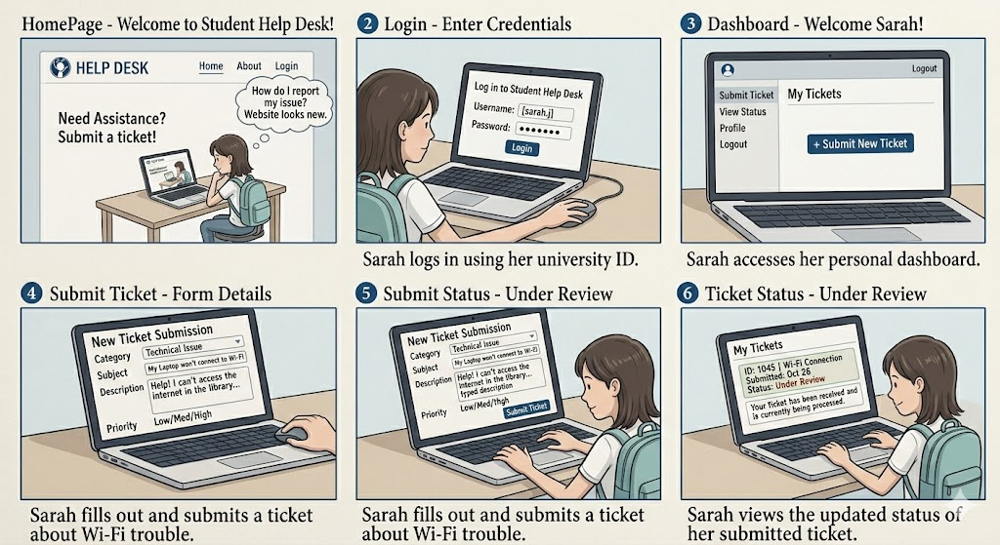
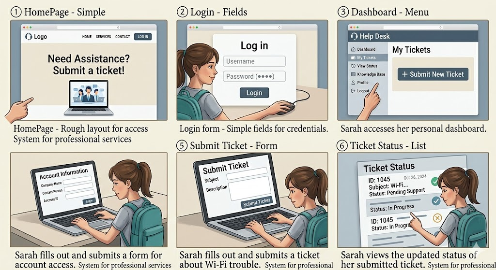
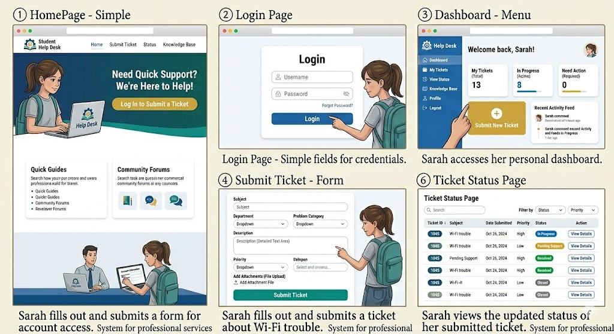

# student-helpdesk-prototype

## 🚀 Project Overview

This repository contains the deliverables for **student-helpdesk-prototype** in the Human–Computer Interaction (HCI) course.

The lab demonstrates how storyboards and prototypes help designers visualize user interactions and explore interface ideas before any development begins.

---

## 🎯 Lab Objective

Use storyboarding and prototyping to:

- Capture key user tasks and interaction flow.
- Communicate design ideas clearly.
- Collect early feedback before committing to implementation.

---

## 🧭 What’s Included

### 1) Storyboard

A storyboard maps the user’s journey step-by-step through the system.

---

### 2) Low-Fidelity Prototype

A low-fidelity prototype focuses on structure and interaction, using simple sketches to define layout and navigation.

---

### 3) High-Fidelity Prototype

A high-fidelity prototype shows the polished visual design, including colors, icons, typography, and UI details.

---

## 🗂️ Repository Contents

- `Storyboard.png` – Storyboard visualization of the user flow
- `Low-Fidelity-Prototype.png` – Sketch-based wireframes
- `High-Fidelity-Prototype.png` – Polished UI mockups
- `Readme.md` – This document

---

## 🧰 Tools Used

- **Paper & pencil** – quick ideation and sketching
- **Figma** – high-fidelity UI design
- **GitHub** – version control and collaboration

---

## ✅ Key Takeaways

Storyboarding and prototyping are essential for:

- Validating assumptions early
- Identifying usability issues before development
- Aligning stakeholders around the same vision

 